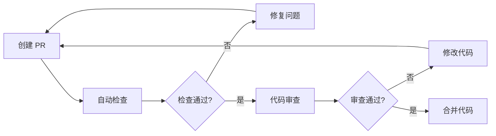
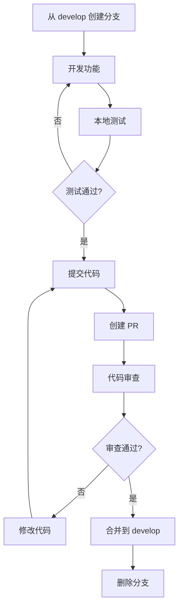

# Life Canvas OS 项目规范文档

> 版本：v1.0.0
> 更新日期：2026-02-05
> 维护团队：Life Canvas OS 开发团队

本文档定义了 Life Canvas OS 项目的开发规范，确保代码质量、可维护性和团队协作效率。

---

## 目录

- [1. 代码规范](#1-代码规范)
- [2. 命名规范](#2-命名规范)
- [3. TypeScript 规范](#3-typescript-规范)
- [4. 组件开发规范](#4-组件开发规范)
- [5. API 请求规范](#5-api-请求规范)
- [6. 状态管理规范](#6-状态管理规范)
- [7. 路由规范](#7-路由规范)
- [8. 样式规范](#8-样式规范)
- [9. 代码审查规范](#9-代码审查规范)
- [10. 测试规范](#10-测试规范)
- [11. 开发流程规范](#11-开发流程规范)
- [12. 项目文档规范](#12-项目文档规范)
- [13. Git 提交规范](#13-git-提交规范)
- [14. 环境变量规范](#14-环境变量规范)
- [15. 性能优化规范](#15-性能优化规范)

---

## 1. 代码规范

### 1.1 代码格式化

项目使用 **Biome** 进行代码格式化和检查，配置位于 `biome.json`。

#### 基本规则

```json
{
  "formatter": {
    "indentStyle": "space",
    "indentWidth": 2,
    "lineWidth": 80,
    "lineEnding": "lf"
  },
  "javascript": {
    "quoteStyle": "single",
    "jsxQuoteStyle": "double",
    "trailingCommas": "es5",
    "semicolons": "asNeeded"
  }
}
```

#### 代码格式要求

- **缩进**：2 空格
- **引号**：JavaScript/TypeScript 使用单引号，JSX 使用双引号
- **行宽**：最大 80 字符
- **行尾**：使用 LF（Unix 风格）
- **分号**：按需添加（as needed）
- **尾随逗号**：ES5 标准

### 1.2 代码组织

#### 文件导入顺序

```typescript
// 1. React 相关
import React, { useState, useEffect } from 'react'
import { BrowserRouter } from 'react-router-dom'

// 2. 第三方库
import { clsx } from 'clsx'
import { twMerge } from 'tailwind-merge'

// 3. 组件库
import { Button } from '~/components/ui/button'
import { Alert } from '~/components/ui/alert'

// 4. 项目内部模块
import { useAuth } from '~/hooks/use-auth'
import { apiClient } from '~/lib/api-client'

// 5. 类型定义
import type { User } from '~/shared/types'

// 6. 样式文件
import './styles.css'
```

#### 导入路径规范

```typescript
// ✅ 推荐：使用路径别名
import { Button } from '~/components/ui/button'
import { useAuth } from '~/hooks/use-auth'
import type { User } from '~/shared/types'

// ❌ 避免：使用相对路径（跨目录时）
import { Button } from '../../../components/ui/button'
```

### 1.3 代码质量规则

项目启用 Biome 推荐规则集：

```json
{
  "linter": {
    "enabled": true,
    "rules": {
      "recommended": true,
      "noUnusedImports": "warn",
      "noExplicitAny": "off",
      "correctness": {
        "noUnusedVariables": "error"
      },
      "style": {
        "useConst": "error",
        "noParameterAssign": "error"
      }
    }
  }
}
```

---

## 2. 命名规范

### 2.1 文件命名

#### TypeScript/JavaScript 文件

```
components/
├── user-profile.tsx          # 组件文件：kebab-case
├── user-profile.test.tsx     # 测试文件：.test.tsx
├── use-user-profile.ts       # Hook 文件：use- 前缀
└── user-profile.types.ts     # 类型文件：.types.ts
```

- **组件文件**：`kebab-case.tsx`
- **Hook 文件**：`use-kebab-case.ts`
- **工具函数**：`kebab-case.ts`
- **类型文件**：`kebab-case.types.ts`
- **常量文件**：`kebab-case.constants.ts`

#### Python 文件

```
backend/
├── main.py                   # 主入口
├── user_service.py           # 服务模块：snake_case
├── user_model.py             # 模型模块：snake_case
└── __init__.py               # 包初始化
```

### 2.2 变量和函数命名

#### JavaScript/TypeScript

```typescript
// ✅ 变量：camelCase
const userName = 'john'
const isActive = true
const maxCount = 100

// ✅ 常量：UPPER_SNAKE_CASE
const API_BASE_URL = 'https://api.example.com'
const MAX_RETRY_COUNT = 3

// ✅ 函数：camelCase，动词开头
function getUserData() {}
function handleSubmit() {}
function calculateTotal() {}

// ✅ 类/接口/类型：PascalCase
class UserService {}
interface UserData {}
type UserRole = 'admin' | 'user'

// ✅ 枚举：PascalCase，成员 UPPER_SNAKE_CASE
enum UserRole {
  ADMIN = 'admin',
  USER = 'user',
  GUEST = 'guest'
}

// ✅ 布尔值：is/has/should 前缀
const isLoading = false
const hasPermission = true
const shouldUpdate = true
```

#### Python

```python
# ✅ 变量/函数：snake_case
user_name = "john"
is_active = True
max_count = 100

def get_user_data():
    pass

# ✅ 常量：UPPER_SNAKE_CASE
API_BASE_URL = "https://api.example.com"
MAX_RETRY_COUNT = 3

# ✅ 类：PascalCase
class UserService:
    pass

# ✅ 私有成员：_前缀
class UserService:
    def __init__(self):
        self._internal_state = None
```

### 2.3 组件命名

#### React 组件

```typescript
// ✅ 组件名称：PascalCase
export function UserProfile() {}
export const UserProfile: React.FC = () => {}

// ❌ 避免：组件名与文件名不一致
// user-profile.tsx
export function UserCard() {}  // ❌ 名称不匹配
```

**规则**：组件名称必须与文件名匹配（转换为 PascalCase）

#### shadcn/ui 组件

```typescript
// components/ui/button.tsx
export function Button({ ... }: ButtonProps) { }

// components/ui/alert.tsx
export function Alert({ children }: AlertProps) {
  return <div>{children}</div>
}
export const AlertTitle = ...  // 子组件使用大写字母前缀
export const AlertDescription = ...
```

### 2.4 目录命名

```
src/
├── components/              # kebab-case
├── user-management/         # kebab-case
└── api/
    └── user-api/            # kebab-case
```

**规则**：所有目录使用 `kebab-case`

---

## 3. TypeScript 规范

### 3.1 类型定义

#### 基本类型使用

```typescript
// ✅ 推荐：使用字面量类型
type Status = 'pending' | 'success' | 'error'
type Role = 'admin' | 'user' | 'guest'

// ✅ 推荐：使用接口定义对象类型
interface User {
  id: string
  name: string
  email: string
  role: Role
  createdAt: Date
}

// ✅ 推荐：使用类型别名定义联合类型
type SearchResult = User | Post | Comment

// ✅ 推荐：使用泛型增强复用性
interface ApiResponse<T> {
  data: T
  message: string
  code: number
}
```

### 3.2 类型导入

```typescript
// ✅ 推荐：类型导入使用 type 关键字
import type { User, UserRole } from '~/shared/types'
import { useEffect } from 'react'  // 值导入

// ✅ 推荐：混合导入
import { userService, type UserData } from '~/services/user'

// ❌ 避免：混合导入而不使用 type 关键字
import { useEffect, type User } from 'react'  // useEffect 不是类型
```

### 3.3 类型断言

```typescript
// ✅ 推荐：使用 as 断言（必要时）
const element = document.getElementById('root') as HTMLDivElement

// ✅ 推荐：使用非空断言（确定值存在时）
const value = getValue()!  // 确定 getValue() 不会返回 null/undefined

// ✅ 推荐：使用类型守卫
function isString(value: unknown): value is string {
  return typeof value === 'string'
}

// ❌ 避免：过度使用 any
const data: any = fetchData()  // ❌

// ✅ 推荐：使用 unknown 替代 any
const data: unknown = fetchData()  // ✅
```

### 3.4 严格模式配置

```json
// tsconfig.json
{
  "compilerOptions": {
    "strict": true,                    // 启用所有严格类型检查
    "noUnusedLocals": true,            // 检查未使用的局部变量
    "noUnusedParameters": true,        // 检查未使用的参数
    "noImplicitReturns": true,         // 检查函数是否有隐式返回
    "noFallthroughCasesInSwitch": true // 检查 switch 中的 fallthrough
  }
}
```

### 3.5 类型导出

```typescript
// ✅ 推荐：显式导出类型
export type { User, UserRole, ApiResponse }

// ✅ 推荐：接口和类型分开导出
export interface UserProps {
  user: User
  onUpdate: (user: User) => void
}

export type UserUpdateFn = (user: User) => void
```

---

## 4. 组件开发规范

### 4.1 组件结构

#### 基本组件模板

```typescript
// components/user-profile.tsx
import { useState, useEffect } from 'react'
import { clsx } from 'clsx'
import type { User } from '~/shared/types'

// 1. 类型定义
interface UserProfileProps {
  user: User
  onEdit?: (user: User) => void
  className?: string
}

// 2. 组件定义
export function UserProfile({ user, onEdit, className }: UserProfileProps) {
  // 3. Hooks（按顺序：state → effect → context → custom hooks）
  const [isEditing, setIsEditing] = useState(false)
  const [formData, setFormData] = useState(user)

  useEffect(() => {
    setFormData(user)
  }, [user])

  // 4. 事件处理函数
  const handleEdit = () => {
    setIsEditing(true)
  }

  const handleSave = () => {
    onEdit?.(formData)
    setIsEditing(false)
  }

  const handleCancel = () => {
    setFormData(user)
    setIsEditing(false)
  }

  // 5. 渲染辅助函数
  const renderActions = () => (
    <div className="flex gap-2">
      <Button onClick={handleSave}>保存</Button>
      <Button onClick={handleCancel} variant="outline">
        取消
      </Button>
    </div>
  )

  // 6. 返回 JSX
  return (
    <div className={clsx('user-profile', className)}>
      {isEditing ? (
        <div>
          <input
            value={formData.name}
            onChange={(e) => setFormData({ ...formData, name: e.target.value })}
          />
          {renderActions()}
        </div>
      ) : (
        <div>
          <h2>{user.name}</h2>
          <p>{user.email}</p>
          <Button onClick={handleEdit}>编辑</Button>
        </div>
      )}
    </div>
  )
}
```

### 4.2 组件分类

#### 展示组件 (Presentational Components)

```typescript
// ❌ 避免：展示组件包含业务逻辑
export function UserList() {
  const [users, setUsers] = useState([])
  useEffect(() => {
    fetch('/api/users').then(res => res.json()).then(setUsers)
  }, [])
  return <div>{/* ... */}</div>
}

// ✅ 推荐：展示组件只负责 UI 渲染
interface UserListProps {
  users: User[]
  loading?: boolean
  onUserClick?: (user: User) => void
}

export function UserList({ users, loading, onUserClick }: UserListProps) {
  if (loading) return <Skeleton count={5} />
  return (
    <ul>
      {users.map(user => (
        <li key={user.id} onClick={() => onUserClick?.(user)}>
          {user.name}
        </li>
      ))}
    </ul>
  )
}
```

#### 容器组件 (Container Components)

```typescript
// ✅ 推荐：容器组件负责数据获取和状态管理
export function UserListContainer() {
  const { data: users, isLoading } = useQuery({
    queryKey: ['users'],
    queryFn: fetchUsers
  })

  const handleUserClick = (user: User) => {
    // 导航到详情页或其他业务逻辑
  }

  return <UserList users={users ?? []} loading={isLoading} onUserClick={handleUserClick} />
}
```

### 4.3 Props 设计原则

#### 必需与可选 Props

```typescript
// ✅ 推荐：明确区分必需和可选 props
interface ButtonProps {
  children: React.ReactNode           // 必需
  variant?: 'default' | 'outline'     // 可选，有默认值
  size?: 'sm' | 'md' | 'lg'           // 可选，有默认值
  disabled?: boolean                  // 可选，默认 false
  onClick?: () => void                // 可选回调
}

export function Button({
  children,
  variant = 'default',
  size = 'md',
  disabled = false,
  onClick
}: ButtonProps) {
  // ...
}
```

#### Props 解构

```typescript
// ✅ 推荐：在函数签名中解构 props
export function UserProfile({ user, onUpdate }: UserProfileProps) {
  // 直接使用 user 和 onUpdate
}

// ❌ 避免：不解构 props
export function UserProfile(props: UserProfileProps) {
  const { user, onUpdate } = props  // 多余的解构
}
```

### 4.4 组件组合模式

```typescript
// ✅ 推荐：使用 children prop 进行组合
export function Card({ children, className }: CardProps) {
  return <div className={clsx('card', className)}>{children}</div>
}

export function CardHeader({ children }: { children: React.ReactNode }) {
  return <div className="card-header">{children}</div>
}

export function CardContent({ children }: { children: React.ReactNode }) {
  return <div className="card-content">{children}</div>
}

// 使用
<Card>
  <CardHeader>
    <h2>标题</h2>
  </CardHeader>
  <CardContent>
    <p>内容</p>
  </CardContent>
</Card>
```

### 4.5 组件性能优化

#### React.memo 使用

```typescript
// ✅ 推荐：对纯展示组件使用 memo
export const UserItem = React.memo(function UserItem({ user }: { user: User }) {
  return <div>{user.name}</div>
})

// ✅ 推荐：自定义比较函数
export const UserItem = React.memo(
  function UserItem({ user }: { user: User }) {
    return <div>{user.name}</div>
  },
  (prevProps, nextProps) => {
    // 只比较 ID
    return prevProps.user.id === nextProps.user.id
  }
)
```

#### useCallback 和 useMemo

```typescript
export function UserProfile({ user }: { user: User }) {
  // ✅ 推荐：缓存回调函数
  const handleClick = useCallback(() => {
    console.log(user.id)
  }, [user.id])  // 只依赖 user.id

  // ✅ 推荐：缓存计算结果
  const displayName = useMemo(() => {
    return `${user.firstName} ${user.lastName}`
  }, [user.firstName, user.lastName])

  // ❌ 避免：过度使用 useMemo（简单计算不需要缓存）
  const doubled = useMemo(() => age * 2, [age])  // ❌ 简单计算

  return (
    <div>
      <h2>{displayName}</h2>
      <button onClick={handleClick}>点击</button>
    </div>
  )
}
```

---

## 5. API 请求规范

### 5.1 API 客户端配置

#### 统一的 API 客户端

```typescript
// src/renderer/lib/api-client.ts
import { IPC_CHANNEL } from '~/shared/constants'

interface ApiRequest {
  action: string
  params?: Record<string, unknown>
}

interface ApiResponse<T = unknown> {
  success: boolean
  data?: T
  error?: string
}

class ApiClient {
  async request<T>(action: string, params?: Record<string, unknown>): Promise<T> {
    const request: ApiRequest = { action, params }

    return new Promise((resolve, reject) => {
      window.electron.ipcRenderer.invoke(IPC_CHANNEL, request)
        .then((response: ApiResponse<T>) => {
          if (response.success) {
            resolve(response.data as T)
          } else {
            reject(new Error(response.error || '请求失败'))
          }
        })
        .catch(reject)
    })
  }

  // 业务 API 方法
  async getUsers() {
    return this.request<User[]>('get_users')
  }

  async createUser(data: CreateUserDto) {
    return this.request<User>('create_user', { data })
  }
}

export const apiClient = new ApiClient()
```

### 5.2 TanStack Query 集成

#### Query Hooks

```typescript
// src/renderer/queries/users.ts
import { useQuery, useMutation, useQueryClient } from '@tanstack/react-query'
import { apiClient } from '~/lib/api-client'
import type { User, CreateUserDto } from '~/shared/types'

// Query Keys
export const queryKeys = {
  users: ['users'] as const,
  user: (id: string) => ['users', id] as const,
}

// Query Hooks
export function useUsers() {
  return useQuery({
    queryKey: queryKeys.users,
    queryFn: () => apiClient.getUsers(),
    staleTime: 5 * 60 * 1000, // 5 分钟
    gcTime: 10 * 60 * 1000,   // 10 分钟
  })
}

export function useUser(id: string) {
  return useQuery({
    queryKey: queryKeys.user(id),
    queryFn: () => apiClient.getUser(id),
    enabled: !!id,  // 只有 id 存在时才执行
  })
}

// Mutation Hooks
export function useCreateUser() {
  const queryClient = useQueryClient()

  return useMutation({
    mutationFn: (data: CreateUserDto) => apiClient.createUser(data),
    onSuccess: () => {
      // 使缓存失效，触发重新获取
      queryClient.invalidateQueries({ queryKey: queryKeys.users })
    },
    // 错误处理
    onError: (error) => {
      console.error('创建用户失败:', error)
    },
  })
}

export function useUpdateUser() {
  const queryClient = useQueryClient()

  return useMutation({
    mutationFn: ({ id, data }: { id: string; data: UpdateUserDto }) =>
      apiClient.updateUser(id, data),
    onMutate: async ({ id, data }) => {
      // 乐观更新
      await queryClient.cancelQueries({ queryKey: queryKeys.user(id) })

      const previousUser = queryClient.getQueryData<User>(queryKeys.user(id))

      queryClient.setQueryData<User>(queryKeys.user(id), (old) =>
        old ? { ...old, ...data } : old
      )

      return { previousUser }
    },
    onError: (err, variables, context) => {
      // 回滚
      if (context?.previousUser) {
        queryClient.setQueryData(queryKeys.user(variables.id), context.previousUser)
      }
    },
    onSettled: (data, error, variables) => {
      // 无论是成功还是失败，都重新获取
      queryClient.invalidateQueries({ queryKey: queryKeys.user(variables.id) })
    },
  })
}
```

### 5.3 错误处理

#### 统一错误处理

```typescript
// src/renderer/lib/error-handler.ts
export class ApiError extends Error {
  constructor(
    message: string,
    public code?: string,
    public statusCode?: number
  ) {
    super(message)
    this.name = 'ApiError'
  }
}

export function handleApiError(error: unknown): never {
  if (error instanceof ApiError) {
    throw error
  }

  if (error instanceof Error) {
    throw new ApiError(error.message)
  }

  throw new ApiError('未知错误')
}

// 在 React Query 中使用
export function useUsers() {
  return useQuery({
    queryKey: queryKeys.users,
    queryFn: () => apiClient.getUsers().catch(handleApiError),
  })
}
```

#### 用户友好的错误提示

```typescript
export function useCreateUser() {
  const { toast } = useToast()

  return useMutation({
    mutationFn: (data: CreateUserDto) => apiClient.createUser(data),
    onError: (error) => {
      let message = '创建用户失败'

      if (error instanceof ApiError) {
        switch (error.code) {
          case 'USER_EXISTS':
            message = '用户已存在'
            break
          case 'INVALID_EMAIL':
            message = '邮箱格式不正确'
            break
          default:
            message = error.message
        }
      }

      toast({
        variant: 'destructive',
        title: '错误',
        description: message,
      })
    },
  })
}
```

### 5.4 API 版本控制

```typescript
// src/shared/constants.ts
export const API_VERSION = 'v1'
export const API_BASE_URL = `/api/${API_VERSION}`

// API 路由定义
export const API_ENDPOINTS = {
  USERS: {
    LIST: `${API_BASE_URL}/users`,
    DETAIL: (id: string) => `${API_BASE_URL}/users/${id}`,
    CREATE: `${API_BASE_URL}/users`,
  },
} as const
```

---

## 6. 状态管理规范

### 6.1 状态分类

#### 服务端状态 (Server State)

使用 **TanStack Query** 管理：

```typescript
// ✅ 服务端状态：从 API 获取的数据
const { data: users, isLoading } = useUsers()
const createUser = useCreateUser()
```

**特点**：
- 数据来自服务器
- 需要缓存和同步
- 有加载、错误状态
- 需要失效和重新获取

#### 客户端状态 (Client State)

使用 **React Hooks** 管理：

```typescript
// ✅ 客户端状态：UI 交互状态
const [isModalOpen, setIsModalOpen] = useState(false)
const [selectedTab, setSelectedTab] = useState('profile')
```

**特点**：
- 仅用于 UI 控制
- 不需要持久化
- 同步更新
- 简单的布尔值、字符串等

#### 全局状态 (Global State)

使用 **Context API** 或 **Zustand**：

```typescript
// ✅ 全局状态：跨组件共享的状态
const AuthContext = createContext<AuthContextValue | null>(null)

export function AuthProvider({ children }: { children: React.ReactNode }) {
  const [user, setUser] = useState<User | null>(null)

  return (
    <AuthContext.Provider value={{ user, setUser }}>
      {children}
    </AuthContext.Provider>
  )
}
```

**特点**：
- 跨多个组件使用
- 不经常变化
- 需要在多处访问

### 6.2 状态管理最佳实践

#### 选择合适的状态管理方案

```typescript
// ❌ 避免：将服务端状态存储在全局状态中
const [users, setUsers] = useState([])  // 不应该这样管理服务端数据

// ✅ 推荐：使用 TanStack Query 管理服务端状态
const { data: users } = useUsers()

// ❌ 避免：将简单的 UI 状态存储在复杂的状态管理中
const zustandStore = create((set) => ({
  isModalOpen: false,  // 太简单了，不需要全局状态
  setModalOpen: (open) => set({ isModalOpen: open })
}))

// ✅ 推荐：本地状态管理简单 UI
const [isModalOpen, setIsModalOpen] = useState(false)
```

#### 状态更新原则

```typescript
// ✅ 推荐：不可变更新
setUsers(prevUsers => [...prevUsers, newUser])

// ✅ 推荐：使用函数式更新
setCount(prevCount => prevCount + 1)

// ❌ 避免：直接修改状态
users.push(newUser)  // ❌ 直接修改
setUsers(users)      // ❌
```

---

## 7. 路由规范

### 7.1 路由配置

#### 路由定义

```typescript
// src/renderer/routes.tsx
import { HashRouter, Routes, Route, Navigate } from 'react-router-dom'
import { AppLayout } from '~/components/layout/app-layout'
import { CanvasPage } from '~/pages/canvas'
import { InsightsPage } from '~/pages/insights'
import { SettingsPage } from '~/pages/settings'

export function AppRoutes() {
  return (
    <HashRouter>
      <Routes>
        {/* 默认重定向 */}
        <Route path="/" element={<Navigate to="/canvas" replace />} />

        {/* 主应用路由 */}
        <Route path="/" element={<AppLayout />}>
          <Route path="canvas" element={<CanvasPage />} />
          <Route path="insights" element={<InsightsPage />} />
          <Route path="history" element={<HistoryPage />} />
          <Route path="journal" element={<JournalPage />} />
          <Route path="settings" element={<SettingsPage />} />

          {/* 动态路由 */}
          <Route path="system/:type" element={<SystemDetailPage />} />
        </Route>

        {/* 404 页面 */}
        <Route path="*" element={<NotFoundPage />} />
      </Routes>
    </HashRouter>
  )
}
```

### 7.2 路由命名规范

```typescript
// ✅ 推荐：使用 kebab-case
<Route path="user-profile" element={<UserProfilePage />} />
<Route path="user-settings" element={<UserSettingsPage />} />

// ✅ 推荐：动态路由使用有意义的名
<Route path="system/:type" element={<SystemDetailPage />} />
<Route path="users/:userId" element={<UserDetailPage />} />

// ❌ 避免：使用 camelCase 或 PascalCase
<Route path="userProfile" element={<UserProfilePage />} />  // ❌
```

### 7.3 路由参数使用

```typescript
// ✅ 推荐：使用 useParams 获取路由参数
export function SystemDetailPage() {
  const { type } = useParams<{ type: string }>()
  const { data: system } = useSystem(type)

  return <div>{system?.name}</div>
}

// ✅ 推荐：使用搜索参数
export function UserListPage() {
  const [searchParams] = useSearchParams()
  const page = parseInt(searchParams.get('page') || '1')
  const { data: users } = useUsers(page)

  return <UserList users={users} />
}

// ✅ 推荐：使用 useNavigate 导航
export function UserCard({ user }: { user: User }) {
  const navigate = useNavigate()

  const handleClick = () => {
    navigate(`/users/${user.id}`)
  }

  return <div onClick={handleClick}>{user.name}</div>
}
```

### 7.4 路由守卫

```typescript
// src/renderer/components/protected-route.tsx
export function ProtectedRoute({
  children,
}: {
  children: React.ReactNode
}) {
  const { user, isLoading } = useAuth()
  const location = useLocation()

  if (isLoading) {
    return <LoadingSpinner />
  }

  if (!user) {
    // 保存当前位置，登录后返回
    return <Navigate to="/login" state={{ from: location }} replace />
  }

  return <>{children}</>
}

// 使用
<Route
  path="settings"
  element={
    <ProtectedRoute>
      <SettingsPage />
    </ProtectedRoute>
  }
/>
```

---

## 8. 样式规范

### 8.1 TailwindCSS 使用规范

#### 类名组织

```typescript
// ✅ 推荐：使用 clsx 和 tailwind-merge
import { clsx } from 'clsx'
import { twMerge } from 'tailwind-merge'

// 合并工具函数
export function cn(...inputs: ClassValue[]) {
  return twMerge(clsx(inputs))
}

// 使用
export function Button({ variant, className }: ButtonProps) {
  return (
    <button
      className={cn(
        'base-classes',           // 基础样式
        variant === 'primary' && 'primary-classes',  // 条件样式
        className                 // 可覆盖的样式
      )}
    >
      {children}
    </button>
  )
}
```

#### 响应式设计

```typescript
// ✅ 推荐：移动优先的响应式设计
<div className="w-full md:w-1/2 lg:w-1/3">
  {/* 移动端：全宽，中等屏幕：半宽，大屏幕：三分之一宽 */}
</div>

// ✅ 推荐：使用断点前缀
<div className="p-4 md:p-6 lg:p-8">
  {/* 移动端：4，中等：6，大屏幕：8 */}
</div>
```

### 8.2 CSS 变量使用

#### 主题变量定义

```css
/* src/renderer/globals.css */
@theme {
  /* 颜色系统 */
  --color-primary: #3b82f6;
  --color-primary-dark: #2563eb;
  --color-secondary: #8b5cf6;

  /* 间距系统 */
  --spacing-xs: 0.25rem;
  --spacing-sm: 0.5rem;
  --spacing-md: 1rem;
  --spacing-lg: 1.5rem;
  --spacing-xl: 2rem;

  /* 字体大小 */
  --font-size-xs: 0.75rem;
  --font-size-sm: 0.875rem;
  --font-size-base: 1rem;
  --font-size-lg: 1.125rem;
  --font-size-xl: 1.25rem;

  /* 圆角 */
  --radius-sm: 0.25rem;
  --radius-md: 0.375rem;
  --radius-lg: 0.5rem;
  --radius-full: 9999px;

  /* 阴影 */
  --shadow-sm: 0 1px 2px 0 rgb(0 0 0 / 0.05);
  --shadow-md: 0 4px 6px -1px rgb(0 0 0 / 0.1);
  --shadow-lg: 0 10px 15px -3px rgb(0 0 0 / 0.1);
}
```

#### 使用 CSS 变量

```typescript
// ✅ 推荐：在 TailwindCSS 中使用变量
<div className="bg-[var(--color-primary)] text-[var(--font-size-base)]">
  内容
</div>

// ✅ 推荐：在 styled-components 或 emotion 中使用
const StyledButton = styled.button`
  background-color: var(--color-primary);
  font-size: var(--font-size-base);
  padding: var(--spacing-sm) var(--spacing-md);
`
```

### 8.3 样式隔离

#### 组件样式

```typescript
// ✅ 推荐：每个组件有自己的样式文件
// components/user-card/
// ├── user-card.tsx
// ├── user-card.test.tsx
// └── user-card.module.css

import styles from './user-card.module.css'

export function UserCard() {
  return <div className={styles.card}>内容</div>
}
```

#### 全局样式

```css
/* ✅ 推荐：全局样式放在 globals.css */
/* src/renderer/globals.css */

/* 重置样式 */
* {
  box-sizing: border-box;
  margin: 0;
  padding: 0;
}

/* 全局工具类 */
.glass-effect {
  backdrop-filter: blur(10px);
  background: rgba(255, 255, 255, 0.1);
}

/* 滚动条样式 */
::-webkit-scrollbar {
  width: 8px;
}

::-webkit-scrollbar-track {
  background: var(--color-background);
}

::-webkit-scrollbar-thumb {
  background: var(--color-border);
  border-radius: 4px;
}
```

### 8.4 样式性能

#### 避免过度嵌套

```css
/* ❌ 避免：过度嵌套 */
.parent .child .grandchild .great-grandchild span {
  color: red;
}

/* ✅ 推荐：扁平化类名 */
.text-red {
  color: red;
}
```

#### 使用 will-change

```css
/* ✅ 推荐：对动画元素使用 will-change */
.animated-element {
  will-change: transform, opacity;
}

/* ⚠️ 注意：不要过度使用，只在需要时添加 */
```

---

## 9. 代码审查规范

### 9.1 Pull Request 规范

#### PR 标题格式

```
<type>(<scope>): <subject>

<body>

<footer>
```

**Type 类型**：
- `feat`: 新功能
- `fix`: 修复 Bug
- `docs`: 文档更新
- `style`: 代码格式（不影响代码运行）
- `refactor`: 重构
- `perf`: 性能优化
- `test`: 测试相关
- `chore`: 构建过程或辅助工具的变动
- `ci`: CI 配置文件和脚本的变动

**示例**：

```
feat(auth): add user login functionality

- Add login form component
- Implement OAuth authentication
- Add JWT token management

Closes #123
```

### 9.2 代码审查清单

#### 功能性检查

- [ ] 代码实现了需求文档中的所有功能
- [ ] 没有引入新的 Bug
- [ ] 边界情况得到处理
- [ ] 错误处理完善

#### 代码质量检查

- [ ] 代码符合项目规范
- [ ] 变量和函数命名清晰
- [ ] 没有重复代码
- [ ] 函数和组件职责单一
- [ ] 代码复杂度合理

#### TypeScript 检查

- [ ] 所有类型正确定义
- [ ] 没有 `any` 类型（除非必要且有注释）
- [ ] 接口和类型正确导出
- [ ] 泛型使用合理

#### 性能检查

- [ ] 没有不必要的重新渲染
- [ ] 大列表使用虚拟滚动
- [ ] 图片和资源优化
- [ ] 没有内存泄漏

#### 测试检查

- [ ] 包含单元测试
- [ ] 测试覆盖核心逻辑
- [ ] 测试通过

#### 文档检查

- [ ] 复杂函数有注释
- [ ] API 变更更新了文档
- [ ] README 更新（如需要）

### 9.3 审查流程



#### 审查者责任

1. **及时响应**：在 24 小时内完成审查
2. **建设性反馈**：提供具体的改进建议
3. **正面鼓励**：认可优秀的代码实现
4. **持续学习**：通过审查互相学习

#### 提交者责任

1. **自测代码**：提交前确保代码通过测试
2. **清晰描述**：PR 描述清晰说明变更内容
3. **响应反馈**：及时处理审查意见
4. **保持简洁**：PR 不要包含过多变更

### 9.4 审查评论规范

#### 评论类型

```typescript
// ✅ 必须修改（Blocking）
// TODO: 需要处理错误情况
const data = await fetchData()

// ✅ 建议修改（Non-blocking）
// Consider: 使用 useCallback 缓存这个函数
const handleClick = () => { ... }

// ✅ 提问（Question）
// 为什么这里使用 useEffect 而不是 useLayoutEffect？
useEffect(() => { ... })

// ✅ 赞赏（Praise）
// 很好的实现！这种方式更高效
const memoizedValue = useMemo(() => computeExpensiveValue(), [deps])
```

---

## 10. 测试规范

### 10.1 测试分层

#### 测试金字塔

```
        /\
       /  \      E2E Tests (10%)
      /____\
     /      \    Integration Tests (20%)
    /________\
   /          \ Unit Tests (70%)
  /____________\
```

- **单元测试**：测试独立的函数和组件（70%）
- **集成测试**：测试模块间的交互（20%）
- **E2E 测试**：测试完整的用户流程（10%）

### 10.2 单元测试

#### 组件测试

```typescript
// components/user-profile.test.tsx
import { render, screen } from '@testing-library/react'
import { describe, it, expect, vi } from 'vitest'
import { UserProfile } from './user-profile'

describe('UserProfile', () => {
  const mockUser = {
    id: '1',
    name: 'John Doe',
    email: 'john@example.com',
  }

  it('should render user information', () => {
    render(<UserProfile user={mockUser} />)

    expect(screen.getByText('John Doe')).toBeInTheDocument()
    expect(screen.getByText('john@example.com')).toBeInTheDocument()
  })

  it('should call onEdit when edit button is clicked', () => {
    const onEdit = vi.fn()
    render(<UserProfile user={mockUser} onEdit={onEdit} />)

    const editButton = screen.getByRole('button', { name: /编辑/i })
    editButton.click()

    expect(onEdit).toHaveBeenCalledWith(mockUser)
  })

  it('should apply custom className', () => {
    const { container } = render(
      <UserProfile user={mockUser} className="custom-class" />
    )

    expect(container.firstChild).toHaveClass('custom-class')
  })
})
```

#### Hook 测试

```typescript
// hooks/use-user-profile.test.ts
import { renderHook, act } from '@testing-library/react'
import { describe, it, expect, vi } from 'vitest'
import { useUserProfile } from './use-user-profile'

describe('useUserProfile', () => {
  it('should fetch user profile on mount', async () => {
    const { result } = renderHook(() => useUserProfile('1'))

    await act(async () => {
      await result.current.fetchProfile()
    })

    expect(result.current.user).toBeDefined()
    expect(result.current.isLoading).toBe(false)
  })

  it('should handle errors', async () => {
    const { result } = renderHook(() => useUserProfile('invalid-id'))

    await act(async () => {
      await result.current.fetchProfile()
    })

    expect(result.current.error).toBeDefined()
  })
})
```

### 10.3 集成测试

#### API 集成测试

```typescript
// integrations/api.test.ts
import { describe, it, expect, beforeAll, afterAll } from 'vitest'
import { apiClient } from '~/lib/api-client'

describe('User API Integration', () => {
  beforeAll(async () => {
    // 启动测试服务器
    await startTestServer()
  })

  afterAll(async () => {
    // 关闭测试服务器
    await stopTestServer()
  })

  it('should fetch users list', async () => {
    const users = await apiClient.getUsers()

    expect(users).toBeInstanceOf(Array)
    expect(users.length).toBeGreaterThan(0)
  })

  it('should create a new user', async () => {
    const newUser = {
      name: 'Test User',
      email: 'test@example.com',
    }

    const user = await apiClient.createUser(newUser)

    expect(user).toHaveProperty('id')
    expect(user.name).toBe(newUser.name)
  })
})
```

### 10.4 E2E 测试

#### Playwright 测试

```typescript
// e2e/user-flow.spec.ts
import { test, expect } from '@playwright/test'

test.describe('User Authentication Flow', () => {
  test('should login successfully', async ({ page }) => {
    await page.goto('http://localhost:3000')

    await page.click('button:text("登录")')
    await page.fill('input[name="email"]', 'user@example.com')
    await page.fill('input[name="password"]', 'password')
    await page.click('button:text("提交")')

    await expect(page).toHaveURL(/.*dashboard/)
    await expect(page.locator('text="欢迎"')).toBeVisible()
  })

  test('should show error for invalid credentials', async ({ page }) => {
    await page.goto('http://localhost:3000/login')

    await page.fill('input[name="email"]', 'invalid@example.com')
    await page.fill('input[name="password"]', 'wrong-password')
    await page.click('button:text("登录")')

    await expect(page.locator('text="登录失败"')).toBeVisible()
  })
})
```

### 10.5 测试覆盖率

#### 覆盖率要求

```json
// vitest.config.ts
export default defineConfig({
  test: {
    coverage: {
      provider: 'v8',
      reporter: ['text', 'json', 'html'],
      statements: 80,    // 语句覆盖率 80%
      branches: 75,      // 分支覆盖率 75%
      functions: 80,     // 函数覆盖率 80%
      lines: 80,         // 行覆盖率 80%
    },
  },
})
```

#### 查看覆盖率报告

```bash
# 运行测试并生成覆盖率报告
pnpm test:coverage

# 查看 HTML 报告
open coverage/index.html
```

---

## 11. 开发流程规范

### 11.1 分支管理策略

#### Git Flow

```
main (生产环境)
  ↑
  ├─ develop (开发环境)
  │    ↑
  │    ├─ feature/user-auth (功能分支)
  │    ├─ feature/data-visualization (功能分支)
  │    └─ feature/ai-insights (功能分支)
  │
  ├─ hotfix/critical-bug (紧急修复)
  └─ release/v1.0.0 (发布分支)
```

#### 分支命名规范

```
feature/<feature-name>     # 新功能
fix/<bug-description>      # Bug 修复
hotfix/<critical-bug>      # 紧急修复
refactor/<description>     # 重构
docs/<description>         # 文档更新
test/<description>         # 测试相关
chore/<description>        # 杂项
```

**示例**：

```bash
feature/user-authentication
fix/login-button-error
hotfix/security-vulnerability
refactor/user-service-optimization
docs/api-documentation
```

### 11.2 开发工作流

#### 功能开发流程



#### 步骤说明

1. **创建功能分支**

```bash
git checkout develop
git pull origin develop
git checkout -b feature/your-feature-name
```

2. **开发和测试**

```bash
# 安装依赖
pnpm install

# 启动开发服务器
pnpm dev

# 运行测试
pnpm test

# 代码格式化
pnpm format
```

3. **提交代码**

```bash
git add .
git commit -m "feat(auth): add user login functionality"
git push origin feature/your-feature-name
```

4. **创建 Pull Request**

- 使用 GitHub/GitLab 界面创建 PR
- 填写 PR 模板
- 关联相关 Issue
- 请求审查

5. **代码审查和合并**

- 至少一人审查通过
- CI 检查通过
- 合并到 develop
- 删除功能分支

### 11.3 版本发布流程

#### 发布检查清单

- [ ] 所有测试通过
- [ ] 代码审查完成
- [ ] 文档更新完整
- [ ] 变更日志（CHANGELOG）更新
- [ ] 版本号更新
- [ ] 性能测试通过
- [ ] 安全扫描通过

#### 发布步骤

```bash
# 1. 创建发布分支
git checkout develop
git checkout -b release/v1.0.0

# 2. 更新版本号
# package.json: "version": "1.0.0"

# 3. 更新 CHANGELOG.md
# 添加新版本的变更内容

# 4. 提交变更
git add .
git commit -m "chore: release v1.0.0"

# 5. 合并到 main 和 develop
git checkout main
git merge release/v1.0.0
git checkout develop
git merge release/v1.0.0

# 6. 打标签
git tag -a v1.0.0 -m "Release v1.0.0"
git push origin v1.0.0

# 7. 构建和发布
pnpm build
pnpm release
```

---

## 12. 项目文档规范

### 12.1 文档结构

```
docs/
├── README.md                  # 项目概述
├── REQUIREMENT.md             # 产品需求文档
├── DESIGN.md                  # 设计文档
├── PROJECT_STANDARDS.md       # 项目规范（本文档）
├── API.md                     # API 文档
├── DEPLOYMENT.md              # 部署文档
├── CONTRIBUTING.md            # 贡献指南
└── CHANGELOG.md               # 变更日志
```

### 12.2 README.md 规范

#### 项目 README

```markdown
# Life Canvas OS

> 基于八维量化模型的 AI 驱动个人成长桌面操作系统

## 项目简介

Life Canvas OS 是一个创新的个人成长管理工具...

## 技术栈

- **前端**: Electron + React 19 + TypeScript
- **后端**: Python + FastAPI
- **数据库**: SQLite
- **UI**: TailwindCSS + shadcn/ui

## 快速开始

### 环境要求

- Node.js >= 18.0.0
- Python >= 3.12
- pnpm >= 8.0.0

### 安装

\`\`\`bash
# 克隆仓库
git clone https://github.com/your-org/life-canvas-os.git

# 安装依赖
pnpm install

# 启动开发服务器
pnpm dev
\`\`\`

## 项目结构

\`\`\`
life-canvas-os/
├── src/              # 源代码
├── backend/          # Python 后端
├── docs/             # 文档
└── tests/            # 测试
\`\`\`

## 开发指南

详见 [PROJECT_STANDARDS.md](./docs/PROJECT_STANDARDS.md)

## 许可证

MIT
```

### 12.3 代码注释规范

#### 文件头注释

```typescript
/**
 * 用户配置组件
 *
 * @description 提供用户个人设置的界面
 * @author Your Name
 * @created 2026-01-15
 */

/**
 * 用户服务模块
 *
 * 提供用户相关的业务逻辑处理
 * 包括：用户 CRUD 操作、认证、权限管理
 */
```

#### 函数注释

```typescript
/**
 * 获取用户列表
 *
 * @param page - 页码（从 1 开始）
 * @param limit - 每页数量
 * @returns 用户列表和分页信息
 * @throws {ApiError} 当请求失败时抛出
 *
 * @example
 * ```typescript
 * const { users, total } = await getUsers(1, 10)
 * ```
 */
export async function getUsers(
  page: number,
  limit: number
): Promise<PaginatedResponse<User>> {
  // 实现
}
```

#### 复杂逻辑注释

```typescript
export function calculateLifeBalance(data: UserData): number {
  // 计算八维平衡指数
  // 公式：∑(各维度得分 × 权重) / 权重总和
  // 权重分配：健康 20%、工作 15%、学习 15%、
  //          家庭 15%、社交 10%、财务 10%、
  //          娱乐 10%、精神 5%

  const weights = {
    health: 0.20,
    work: 0.15,
    learning: 0.15,
    family: 0.15,
    social: 0.10,
    finance: 0.10,
    entertainment: 0.10,
    spiritual: 0.05,
  }

  return Object.entries(weights).reduce((total, [key, weight]) => {
    return total + (data[key] * weight)
  }, 0)
}
```

### 12.4 API 文档规范

#### OpenAPI 规范

```yaml
# backend/api/docs/openapi.yaml
openapi: 3.0.0
info:
  title: Life Canvas OS API
  version: 1.0.0
  description: Life Canvas OS 后端 API 文档

paths:
  /api/v1/users:
    get:
      summary: 获取用户列表
      tags: [Users]
      parameters:
        - name: page
          in: query
          schema:
            type: integer
            default: 1
        - name: limit
          in: query
          schema:
            type: integer
            default: 10
      responses:
        '200':
          description: 成功
          content:
            application/json:
              schema:
                type: object
                properties:
                  data:
                    type: array
                    items:
                      $ref: '#/components/schemas/User'
                  total:
                    type: integer
```

---

## 13. Git 提交规范

### 13.1 Commit Message 格式

#### 基本格式

```
<type>(<scope>): <subject>

<body>

<footer>
```

#### Type 类型

| Type | 说明 | 示例 |
|------|------|------|
| `feat` | 新功能 | `feat(auth): add OAuth login` |
| `fix` | Bug 修复 | `fix(api): handle null response` |
| `docs` | 文档更新 | `docs(readme): update installation guide` |
| `style` | 代码格式 | `style: format code with biome` |
| `refactor` | 重构 | `refactor(user): simplify user service` |
| `perf` | 性能优化 | `perf(chart): optimize rendering` |
| `test` | 测试相关 | `test(auth): add login tests` |
| `chore` | 构建/工具 | `chore: update dependencies` |
| `ci` | CI 配置 | `ci: add GitHub Actions workflow` |

#### Subject 规则

- 使用动词原形开头
- 首字母小写
- 不以句号结尾
- 限制在 50 字符以内

#### Body 规则

- 描述做什么和为什么做（不是怎么做）
- 每行限制在 72 字符以内
- 说明 Breaking Changes

#### Footer 规则

- 关联 Issue：`Closes #123`
- Breaking Changes：以 `BREAKING CHANGE:` 开头

### 13.2 Commit Message 示例

#### 简单提交

```
feat(auth): add user login functionality

实现用户登录功能，包括：
- 登录表单组件
- JWT token 验证
- 错误处理

Closes #123
```

#### 复杂提交

```
feat(api): implement user CRUD operations

添加用户管理相关的 API 端点：
- GET /api/users - 获取用户列表
- GET /api/users/:id - 获取用户详情
- POST /api/users - 创建用户
- PUT /api/users/:id - 更新用户
- DELETE /api/users/:id - 删除用户

使用 SQLAlchemy ORM 进行数据库操作。
添加 Pydantic 验证确保数据完整性。

Closes #45, #46
```

#### Breaking Changes

```
feat(api): redesign authentication flow

重构认证流程，使用 OAuth 2.0 替代旧的 JWT 认证。

BREAKING CHANGE:
- 移除 `/api/auth/login` 端点
- 新增 `/api/oauth/authorize` 端点
- Token 格式从 JWT 改为 OAuth Access Token

迁移指南：
1. 更新客户端以使用新的 OAuth 流程
2. 替换 token 验证逻辑
3. 参考迁移文档：docs/migration/oauth.md
```

### 13.3 Commit 工具

#### 使用 Commitizen

```bash
# 安装 commitizen
pnpm add -D commitizen cz-conventional-changelog

# 配置 package.json
"config": {
  "commitizen": {
    "path": "cz-conventional-changelog"
  }
}

# 使用
pnpm commit  # 代替 git commit
```

#### Commitlint 配置

```javascript
// commitlint.config.js
module.exports = {
  extends: ['@commitlint/config-conventional'],
  rules: {
    'type-enum': [2, 'always', [
      'feat', 'fix', 'docs', 'style', 'refactor',
      'perf', 'test', 'chore', 'ci'
    ]],
    'subject-case': [0],
  },
}
```

---

## 14. 环境变量规范

### 14.1 环境变量管理

#### 环境分类

```bash
# .env.development - 开发环境
NODE_ENV=development
VITE_API_BASE_URL=http://localhost:8000
VITE_ENABLE_DEV_TOOLS=true

# .env.staging - 预发布环境
NODE_ENV=production
VITE_API_BASE_URL=https://staging-api.example.com
VITE_ENABLE_DEV_TOOLS=false

# .env.production - 生产环境
NODE_ENV=production
VITE_API_BASE_URL=https://api.example.com
VITE_ENABLE_DEV_TOOLS=false
```

### 14.2 环境变量命名

#### 命名规则

```bash
# ✅ 推荐：使用前缀区分
VITE_API_KEY=xxx          # Vite 前端变量
ELECTRON_APP_VERSION=1.0  # Electron 相关
PYTHON_PATH=/usr/bin/python3

# ✅ 推荐：使用下划线分隔
DATABASE_URL=postgresql://...
REDIS_HOST=localhost
REDIS_PORT=6379

# ❌ 避免：混合命名风格
ApiBaseUrl=xxx  # ❌ 应该大写
api-base-url=xxx  # ❌ 应该使用下划线
```

### 14.3 环境变量使用

#### 前端使用

```typescript
// src/renderer/config/env.ts
// ✅ 推荐：集中管理环境变量
export const config = {
  apiUrl: import.meta.env.VITE_API_BASE_URL,
  enableDevTools: import.meta.env.VITE_ENABLE_DEV_TOOLS === 'true',
  appVersion: import.meta.env.VITE_APP_VERSION,
} as const

// 使用
import { config } from '~/config/env'

fetch(`${config.apiUrl}/users`)
```

#### 后端使用

```python
# backend/core/config.py
# ✅ 推荐：使用 pydantic-settings
from pydantic_settings import BaseSettings

class Settings(BaseSettings):
    """应用配置"""

    # 数据库配置
    database_url: str = "sqlite:///./life_canvas.db"

    # API 配置
    api_host: str = "127.0.0.1"
    api_port: int = 8000

    # OpenAI 配置
    openai_api_key: str = ""
    openai_base_url: str = "https://api.openai.com/v1"

    class Config:
        env_file = ".env"
        case_sensitive = False

settings = Settings()

# 使用
from backend.core.config import settings

database_url = settings.database_url
```

### 14.4 敏感信息保护

#### .env.example 模板

```bash
# .env.example
# 这是环境变量模板，复制为 .env 并填写实际值

# API 配置
VITE_API_BASE_URL=http://localhost:8000

# OpenAI 配置
OPENAI_API_KEY=your_api_key_here
OPENAI_BASE_URL=https://api.openai.com/v1

# 数据库配置
DATABASE_URL=sqlite:///./life_canvas.db
```

#### .gitignore 配置

```gitignore
# 环境变量文件
.env
.env.local
.env.*.local

# 敏感文件
*.key
*.pem
secrets/
```

---

## 15. 性能优化规范

### 15.1 前端性能优化

#### 组件优化

```typescript
// ✅ 推荐：使用 React.memo 避免不必要的重渲染
export const UserCard = React.memo(({ user }: { user: User }) => {
  return <div>{user.name}</div>
})

// ✅ 推荐：使用 useMemo 缓存计算结果
export function Chart({ data }: { data: DataPoint[] }) {
  const processedData = useMemo(() => {
    return processData(data)
  }, [data])

  return <LineChart data={processedData} />
}

// ✅ 推荐：使用 useCallback 缓存回调函数
export function Form() {
  const handleSubmit = useCallback((values: FormValues) => {
    submitForm(values)
  }, [])

  return <UserForm onSubmit={handleSubmit} />
}
```

#### 虚拟滚动

```typescript
// ✅ 推荐：大列表使用虚拟滚动
import { useVirtualizer } from '@tanstack/react-virtual'

export function UserList({ users }: { users: User[] }) {
  const parentRef = useRef<HTMLDivElement>(null)

  const virtualizer = useVirtualizer({
    count: users.length,
    getScrollElement: () => parentRef.current,
    estimateSize: () => 50,  // 每项高度
  })

  return (
    <div ref={parentRef} style={{ height: '400px', overflow: 'auto' }}>
      <div style={{ height: `${virtualizer.getTotalSize()}px` }}>
        {virtualizer.getVirtualItems().map((virtualItem) => (
          <div
            key={virtualItem.key}
            style={{
              position: 'absolute',
              top: 0,
              left: 0,
              width: '100%',
              height: `${virtualItem.size}px`,
              transform: `translateY(${virtualItem.start}px)`,
            }}
          >
            <UserCard user={users[virtualItem.index]} />
          </div>
        ))}
      </div>
    </div>
  )
}
```

#### 代码分割

```typescript
// ✅ 推荐：路由级别的代码分割
import { lazy, Suspense } from 'react'

const CanvasPage = lazy(() => import('~/pages/canvas'))
const InsightsPage = lazy(() => import('~/pages/insights'))

export function AppRoutes() {
  return (
    <Suspense fallback={<LoadingScreen />}>
      <Routes>
        <Route path="/canvas" element={<CanvasPage />} />
        <Route path="/insights" element={<InsightsPage />} />
      </Routes>
    </Suspense>
  )
}
```

### 15.2 资源优化

#### 图片优化

```typescript
// ✅ 推荐：使用 Next.js Image 或类似方案
import Image from 'next/image'

<Image
  src="/profile.jpg"
  alt="Profile"
  width={200}
  height={200}
  loading="lazy"
/>

// ✅ 推荐：提供多种格式
<picture>
  <source srcSet="profile.webp" type="image/webp" />
  <source srcSet="profile.jpg" type="image/jpeg" />
  
</picture>
```

#### 字体优化

```css
/* ✅ 推荐：使用 font-display */
@font-face {
  font-family: 'CustomFont';
  src: url('./custom-font.woff2') format('woff2');
  font-display: swap;  /* 避免不可见文本闪烁 */
}

/* ✅ 推荐：只导入需要的字符 */
@import url('https://fonts.googleapis.com/css2?family=Noto+Sans+SC:wght@400;500;700&display=swap');
```

### 15.3 后端性能优化

#### 数据库查询优化

```python
# ✅ 推荐：使用索引
from sqlalchemy import Index

class User(Base):
    __tablename__ = 'users'

    id = Column(Integer, primary_key=True)
    email = Column(String(255), unique=True, index=True)  # 添加索引
    created_at = Column(DateTime, index=True)  # 添加索引

    __table_args__ = (
        Index('idx_user_email_created', 'email', 'created_at'),
    )

# ✅ 推荐：使用 select_related/preload （避免 N+1 查询）
def get_users_with_sessions():
    return (
        db.query(User)
        .options(select_related(User.sessions))  # 预加载关联数据
        .all()
    )

# ✅ 推荐：分页查询
def get_users(page: int = 1, per_page: int = 10):
    return (
        db.query(User)
        .offset((page - 1) * per_page)
        .limit(per_page)
        .all()
    )
```

#### 缓存策略

```python
# ✅ 推荐：使用缓存
from functools import lru_cache
from fastapi_cache import FastAPICache
from fastapi_cache.backends.redis import RedisBackend

@lru_cache(maxsize=128)
def calculate_life_balance(user_id: str) -> float:
    """缓存计算结果"""
    # 复杂计算
    return result

@router.get("/api/users/{user_id}")
@cache(expire=60)  # 缓存 60 秒
async def get_user(user_id: str):
    return await fetch_user(user_id)
```

### 15.4 Electron 性能优化

#### 主进程优化

```typescript
// src/main/index.ts
// ✅ 推荐：懒加载窗口
export class WindowManager {
  private windows: Map<string, BrowserWindow> = new Map()

  openWindow(name: string) {
    if (this.windows.has(name)) {
      this.windows.get(name)?.focus()
      return
    }

    const win = new BrowserWindow({
      // 配置
    })

    this.windows.set(name, win)

    win.on('closed', () => {
      this.windows.delete(name)
    })
  }
}

// ✅ 推荐：使用 webPreferences 优化
const win = new BrowserWindow({
  webPreferences: {
    nodeIntegration: false,
    contextIsolation: true,
    sandbox: true,
    webSecurity: true,
    preload: path.join(__dirname, '../preload/index.js'),
  },
})
```

#### IPC 通信优化

```typescript
// ✅ 推荐：批量处理请求
class IPCBatcher {
  private queue: Array<{ request: ApiRequest; resolve: Function }> = []
  private timer: NodeJS.Timeout | null = null

  add(request: ApiRequest): Promise<any> {
    return new Promise((resolve) => {
      this.queue.push({ request, resolve })

      if (!this.timer) {
        this.timer = setTimeout(() => this.flush(), 100)  // 100ms 批处理
      }
    })
  }

  flush() {
    const batch = this.queue.splice(0)
    this.timer = null

    // 批量发送
    ipcRenderer.send(IPC_CHANNEL, batch.map(item => item.request))

    // 处理响应
    ipcRenderer.once(IPC_CHANNEL, (_, responses) => {
      batch.forEach((item, index) => {
        item.resolve(responses[index])
      })
    })
  }
}
```

### 15.5 性能监控

#### 前端监控

```typescript
// src/renderer/lib/performance.ts
export function measurePerformance(name: string, fn: () => void) {
  performance.mark(`${name}-start`)
  fn()
  performance.mark(`${name}-end`)
  performance.measure(name, `${name}-start`, `${name}-end`)

  const measure = performance.getEntriesByName(name)[0]
  console.log(`${name} took ${measure.duration}ms`)

  // 上报到监控服务
  reportMetric(name, measure.duration)
}

// 使用
measurePerformance('render-chart', () => {
  renderChart(data)
})
```

#### 后端监控

```python
# backend/middleware/performance.py
import time
from fastapi import Request

@app.middleware("http")
async def add_process_time_header(request: Request, call_next):
    start_time = time.time()
    response = await call_next(request)
    process_time = time.time() - start_time

    # 记录慢请求
    if process_time > 1.0:
        logger.warning(f"Slow request: {request.url} took {process_time:.2f}s")

    response.headers["X-Process-Time"] = str(process_time)
    return response
```

---

## 附录

### A. 常用命令

#### 开发命令

```bash
# 启动开发服务器
pnpm dev

# 构建项目
pnpm build

# 运行测试
pnpm test

# 代码格式化
pnpm format

# 代码检查
pnpm lint

# 类型检查
pnpm typecheck
```

#### Git 命令

```bash
# 查看状态
git status

# 查看分支
git branch -a

# 切换分支
git checkout <branch>

# 创建并切换分支
git checkout -b <branch>

# 合并分支
git merge <branch>

# 变基
git rebase <branch>

# 撤销最后一次提交
git reset --soft HEAD~1

# 查看日志
git log --oneline --graph --all
```

### B. 推荐资源

#### 学习资源

- [React 官方文档](https://react.dev)
- [TypeScript 手册](https://www.typescriptlang.org/docs/)
- [Electron 文档](https://www.electronjs.org/docs)
- [TailwindCSS 文档](https://tailwindcss.com/docs)
- [TanStack Query 文档](https://tanstack.com/query/latest)

#### 工具推荐

- **VS Code**: 推荐的 IDE
- **Biome**: 代码格式化和检查
- **Vitest**: 单元测试框架
- **Playwright**: E2E 测试框架
- **Prefer**: 验证依赖版本

### C. 常见问题

#### Q1: 如何添加新的 UI 组件？

参考 shadcn/ui 的组件结构，使用以下命令：

```bash
pnpm dlx shadcn@latest add button
```

#### Q2: 如何调试 Electron 应用？

```bash
# 开发模式下会自动打开 DevTools
pnpm dev

# 或在代码中手动打开
mainWindow.webContents.openDevTools()
```

#### Q3: 如何处理跨平台问题？

- 使用 `path` 模块处理路径
- 使用 `process.platform` 判断平台
- 使用统一的 API 封装平台差异

---

## 更新日志

| 版本 | 日期 | 变更内容 |
|------|------|----------|
| v1.0.0 | 2026-02-05 | 初始版本，定义完整的项目规范 |

---

**维护团队**: Life Canvas OS 开发团队
**最后更新**: 2026-02-05
